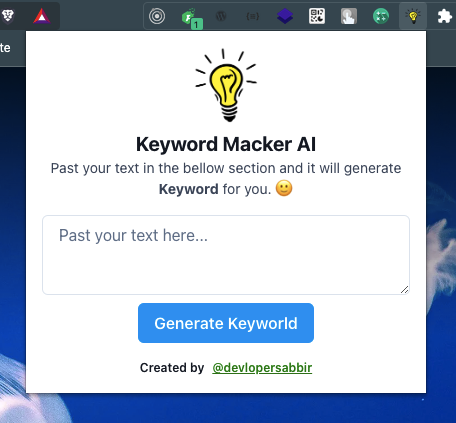
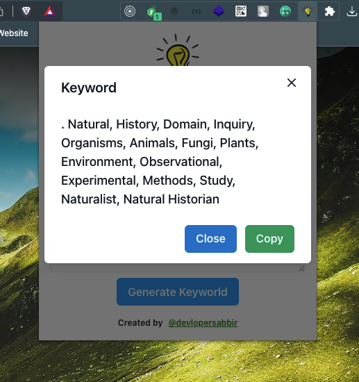

# A powerfull keyword maker chrome extension

**A powerfull keyword maker chrome extension. Give a paragraph it's make keyword for you.** This extesnion help us to create keyword based on your prompt. If you are enter any `pragraph`, `Blog text` or any of the `Content` then I will generate for you keyword with [openAI](https://platform.openai.com/docs/api-reference/completions) completions tools.

Here is the extesnion interface
|Main/Home Screen|Modal Screen|
| -------- | -------- |
 | 

## How to use it?

- Clone this repositorie with this command

```console
git clone https://github.com/devlopersabbir/keyword-generator-chrome-extension.git
```

# Stop!

- You have to create a `api_key` from [openAI](https://platform.openai.com/account/api-keys) and you have to past.

  - To past the `api_key` please go to the src -> App.tsx and assign your `api_key` into this veriable

  ```ts
  const YOUR_API_KEY = "sk-oxxxxxxxxxxxxxxxxxxxxxxxxxxxxx";
  ```

- Now change your directory and install all dependencies aslo build extesnion when clone finished.

```console
cd keyword-generator-chrome-extension && npm i && npm run build
```

- When you have finished build this extesnion then you will see a directory called `dist`.
- So far, are in the last step now. Go to your extension page and upload your `dist` forlder. that's it.

#### Author

This package created by [Sabbir Hossain Shuvo](https://www.showwcase.com/devlopersabbir). And the GitHub profile is [https://github.com/devlopersabbir](https://github.com/devlopersabbir).

#### LICENSE

MIT
